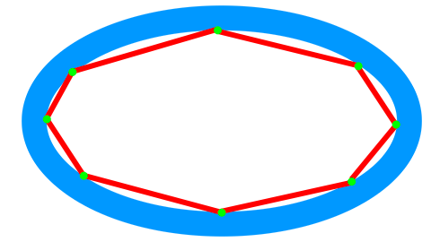
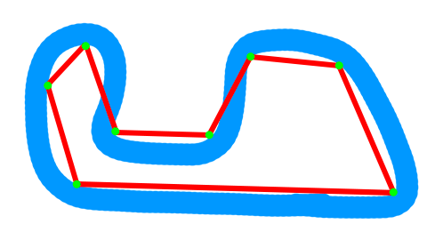
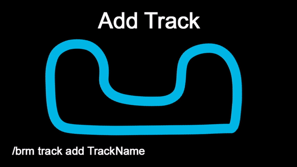

# BoatRaceMod
This is a fabricmc mod for formula-1-like boat race events on server.

It must be installed both on server and on client to work. Players without installed mod won't see race status messages and race HUD.

## Track Skeleton
Race based on track skeleton. The skeleton is made up of points between which imaginary lines (segments) are drawn. During race, players rides along those segments and the mod can calculate top-list of racers properly.
Points always must be inside the turns. Check the examples:
 
## Commands
All commands only accessible for OP's, but also you can add Players to access-list in config file: 'BoatRaceMod.json'. Add player names to 'hasAccess' list there (in quotes and separated by commas).
### Racers list
- '/brm racers list' - shows the list of racers
- '/brm racers add <PlayerName\> <ShortName\>' - adds Player to Racers list
- '/brm racers remove <RacerName\>' = removes Racer from list
### Tracks
- '/brm track add <TrackName\>' - creates new Track with name
- '/brm track remove <TrackName\>' - deletes track
- '/brm track edit <TrackName\> newpoint <PointIndex\> <PosX\> <PosZ\> <Start|Sector|Default\>' - adds new Point to the Track. 

Default Points are just nodes for Track Skeleton (Start and Sector points are nodes too) 

Start point defines the start line (It's perpendicular to pre-start segment) 

Sector points are used to delimit sectors. 

  
- '/brm track edit <TrackName\> removelastpoint' - removes last added point from track
### Race Event
- '/brm race startevent <TrackName\> <LapsNumber\>' - starts race event on existing track. The specified number of laps players must complete to finish
- '/brm go <CountDownTime\>' - starts the countdown to race start (in seconds)
- '/brm race stop' - freezes the timer. To start it unfreeze use '/brm go'
- '/brm race finishevent confirm' - finishes race event